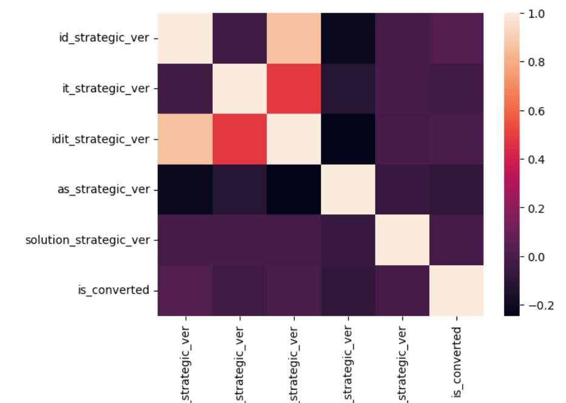
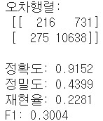

# LGAimers_B2B_data_

## 프로젝트 목적 및 설명
기업 간 영업 전환 전략 데이터 분석입니다. 이 프로젝트에서의 제 역할은 데이터 전처리(결측치 대체, 이상치 제거)입니다. 
기업 영업 실태에 대한 데이터의 Attribute을 기준으로 평균, 중앙값, 최빈값, 중앙값으로 결측치를 대체하였습니다. 그리고 이상치를 boxplot이라는 시각화 그래프를 이용하여서 확인하였습니다. 제 1분위수 이하인 표본과 제 3사분위수 이상의 범위를 가진 데이터를 이상치로 간주하고 제거하는 역할을 하였습니다.

## 프로젝트 과정
1. 데이터를 통해서 EDA 기법을 이용하여서 여러 그래프들을 데이터로 시각화하였습니다. 

2. 서로 다른 데이터들의 attribute 요소들을 연관-독립관계에 대해서 측정을 하였습니다.

3. 종속변수와 연관되는 요소를 제외한 서로 관련이 없는 attribute 요소들을 제거 한 다음, 주어진 attribute의 정의의 특성을 이용하여서 attribute을 새로 생성하거나, 대체를 하였습니다.
4. 대체한 attribute인 경우 데이터 타입에 따라서 결측치를 대체합니다.
   + attribute의 값이 문자열이라면, 문자열에 대한 최빈값(문자열)을 이용하여서 대체합니다.
   + attribute의 값이 숫자라면 숫자에 대한 표준편차의 상황에 따라서 평균, 중앙값으로 대체합니다.
     - 만약 표준편차의 값이 크면 각 표본의 중앙값으로 대체합니다.
     - 표준편차의 값이 작으면 각 표본의 평균으로 대체합니다.
5. 결측치를 대체한 후에는 분류모델인 decisiontree 모델을 이용하여서 classifcation으로 학습 및 예측합니다.
6. 그 결과 결과값에 대해서 평가하며, label로 정합니다.

## 프로젝트 결과 with Confusion matrix
+ Confusion Matrix
+ 정확도(Accuracy)
+ 정밀도(Precision)
+ 재현율(Recall)
+ F1-score  
결과 image  

